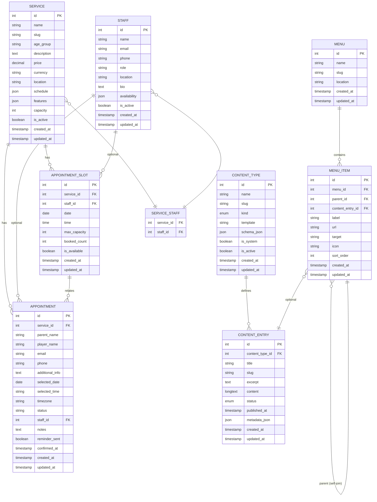

# TGLFC Entity Relationship Diagram (ERD)

## Mermaid Diagram



---

## Entity Details

### SERVICE (Training Programmes)

| Column | Type | Null | Key | Notes |
|--------|------|------|-----|-------|
| id | BIGINT | NO | PK | |
| name | VARCHAR(255) | NO | | "Mini Kickers", "Development Squad" |
| slug | VARCHAR(255) | NO | UQ | auto-generated from name |
| age_group | VARCHAR(50) | NO | | "U5–U8", "U9–U12", "U13–U18" |
| description | TEXT | YES | | Longer description |
| price | DECIMAL(8,2) | NO | | e.g., 5.00, 7.00 |
| currency | VARCHAR(3) | NO | | e.g., "GBP" |
| location | VARCHAR(255) | NO | | "North London" |
| schedule | JSON | NO | | `{days: ["Monday", "Wednesday"], times: ["5:30 PM"]}` |
| features | JSON | NO | | `["Technical skills focus", "Small-sided games"]` |
| capacity | INT | YES | | Max students per session |
| is_active | BOOLEAN | NO | | Default: true |
| created_at | TIMESTAMP | NO | | |
| updated_at | TIMESTAMP | NO | | |

---

### STAFF (Coaches/Instructors)

| Column | Type | Null | Key | Notes |
|--------|------|------|-----|-------|
| id | BIGINT | NO | PK | |
| name | VARCHAR(255) | NO | | |
| email | VARCHAR(255) | NO | UQ | |
| phone | VARCHAR(20) | YES | | |
| role | VARCHAR(50) | NO | | "coach", "assistant", "admin" |
| location | VARCHAR(255) | YES | | |
| bio | TEXT | YES | | |
| availability | JSON | YES | | `{monday: ["09:00-12:00"], wednesday: []}` |
| is_active | BOOLEAN | NO | | Default: true |
| created_at | TIMESTAMP | NO | | |
| updated_at | TIMESTAMP | NO | | |

---

### APPOINTMENT_SLOT (Available Booking Slots)

| Column | Type | Null | Key | Notes |
|--------|------|------|-----|-------|
| id | BIGINT | NO | PK | |
| service_id | BIGINT | NO | FK → SERVICE | Which programme |
| staff_id | BIGINT | YES | FK → STAFF | Optional: specific coach |
| date | DATE | NO | | |
| time | TIME | NO | | e.g., "09:00:00" |
| max_capacity | INT | NO | | e.g., 15 |
| booked_count | INT | NO | | e.g., 12 (current bookings) |
| is_available | BOOLEAN | NO | | false if staff unavailable |
| created_at | TIMESTAMP | NO | | |
| updated_at | TIMESTAMP | NO | | |

**Indexes:**
```sql
UNIQUE(service_id, date, time, staff_id)
INDEX(date)
INDEX(is_available)
```

---

### APPOINTMENT (Bookings)

| Column | Type | Null | Key | Notes |
|--------|------|------|-----|-------|
| id | BIGINT | NO | PK | |
| service_id | BIGINT | NO | FK → SERVICE | Which programme booked |
| parent_name | VARCHAR(255) | NO | | |
| player_name | VARCHAR(255) | NO | | |
| email | VARCHAR(255) | NO | | |
| phone | VARCHAR(20) | YES | | |
| additional_info | TEXT | YES | | Medical conditions, experience |
| selected_date | DATE | NO | | |
| selected_time | VARCHAR(10) | NO | | e.g., "09:00 AM" |
| timezone | VARCHAR(50) | NO | | e.g., "Europe/London" |
| status | ENUM | NO | | pending, confirmed, rejected, cancelled |
| staff_id | BIGINT | YES | FK → STAFF | Assigned coach (if booked with specific) |
| notes | TEXT | YES | | Admin notes |
| reminder_sent | BOOLEAN | NO | | Default: false |
| confirmed_at | TIMESTAMP | YES | | When admin confirmed |
| created_at | TIMESTAMP | NO | | |
| updated_at | TIMESTAMP | NO | | |

**Indexes:**
```sql
INDEX(email)
INDEX(status)
INDEX(selected_date)
INDEX(created_at)
```

---

### CONTENT_TYPE (Page Type Definitions)

| Column | Type | Null | Key | Notes |
|--------|------|------|-----|-------|
| id | BIGINT | NO | PK | |
| name | VARCHAR(255) | NO | | "Home", "About", "Training" |
| slug | VARCHAR(255) | NO | UQ | "home", "about", "training" |
| kind | ENUM | NO | | singleton, collection |
| template | VARCHAR(50) | NO | | Vue template name |
| schema_json | JSON | YES | | Future: field definitions |
| is_system | BOOLEAN | NO | | true for built-in types |
| is_active | BOOLEAN | NO | | Default: true |
| created_at | TIMESTAMP | NO | | |
| updated_at | TIMESTAMP | NO | | |

---

### CONTENT_ENTRY (Page Instances)

| Column | Type | Null | Key | Notes |
|--------|------|------|-----|-------|
| id | BIGINT | NO | PK | |
| content_type_id | BIGINT | NO | FK → CONTENT_TYPE | Which type this is |
| title | VARCHAR(255) | NO | | |
| slug | VARCHAR(255) | NO | UQ | For single routes |
| excerpt | TEXT | YES | | Short summary |
| content | LONGTEXT | NO | | Rich HTML/markdown |
| status | ENUM | NO | | draft, published, archived |
| published_at | TIMESTAMP | YES | | When published |
| metadata_json | JSON | YES | | Custom fields |
| created_at | TIMESTAMP | NO | | |
| updated_at | TIMESTAMP | NO | | |

**Indexes:**
```sql
INDEX(content_type_id)
INDEX(status)
INDEX(published_at)
```

---

### MENU (Navigation Groups)

| Column | Type | Null | Key | Notes |
|--------|------|------|-----|-------|
| id | BIGINT | NO | PK | |
| name | VARCHAR(255) | NO | | "Main Navigation", "Footer" |
| slug | VARCHAR(255) | NO | UQ | "main", "footer" |
| location | VARCHAR(50) | NO | | "header", "footer", "mobile" |
| created_at | TIMESTAMP | NO | | |
| updated_at | TIMESTAMP | NO | | |

---

### MENU_ITEM (Navigation Items)

| Column | Type | Null | Key | Notes |
|--------|------|------|-----|-------|
| id | BIGINT | NO | PK | |
| menu_id | BIGINT | NO | FK → MENU | Which menu |
| parent_id | BIGINT | YES | FK → MENU_ITEM | For nesting (self-join) |
| content_entry_id | BIGINT | YES | FK → CONTENT_ENTRY | Links to content page |
| label | VARCHAR(255) | NO | | Display text |
| url | VARCHAR(255) | YES | | For external links |
| target | VARCHAR(10) | NO | | "_self" or "_blank" |
| icon | VARCHAR(50) | YES | | Lucide icon name |
| sort_order | INT | NO | | For ordering |
| created_at | TIMESTAMP | NO | | |
| updated_at | TIMESTAMP | NO | | |

**Constraint:** Either `content_entry_id` OR `url` must be set

---

### SERVICE_STAFF (Many-to-Many)

| Column | Type | Null | Key | Notes |
|--------|------|------|-----|-------|
| service_id | BIGINT | NO | PK+FK → SERVICE | |
| staff_id | BIGINT | NO | PK+FK → STAFF | |

---

## Relationships Summary

### One-to-Many

```
SERVICE (1) ──────── (Many) APPOINTMENT
  └─ A service can have many appointments

SERVICE (1) ──────── (Many) APPOINTMENT_SLOT
  └─ A service has multiple available time slots

STAFF (1) ──────── (Many) APPOINTMENT (optional)
  └─ A coach can be assigned to appointments

STAFF (1) ──────── (Many) APPOINTMENT_SLOT (optional)
  └─ A coach can be assigned to specific slots

CONTENT_TYPE (1) ──────── (Many) CONTENT_ENTRY
  └─ A type defines many entries (e.g., Articles)

MENU (1) ──────── (Many) MENU_ITEM
  └─ A menu has many items
```

### Many-to-Many

```
SERVICE (Many) ───── (Many) STAFF
  └─ Via SERVICE_STAFF table
  └─ A service can have many coaches, a coach can teach many services
```

### Self-Join

```
MENU_ITEM (Many) ─── (Many) MENU_ITEM
  └─ Via parent_id column
  └─ Items can have nested children (submenu)
```

### Optional/Nullable

```
APPOINTMENT_SLOT.staff_id → STAFF (nullable)
  └─ Slot can be for any available coach or specific coach

APPOINTMENT.staff_id → STAFF (nullable)
  └─ Appointment may not be assigned to a coach yet

MENU_ITEM.content_entry_id → CONTENT_ENTRY (nullable)
  └─ Item can be external URL (no content entry)

MENU_ITEM.url (nullable)
  └─ Item can link to content or external URL
```

---

## Query Patterns

### Get All Available Slots for a Service

```sql
SELECT *
FROM appointment_slots
WHERE service_id = ? 
  AND date >= NOW()
  AND is_available = true
  AND booked_count < max_capacity
ORDER BY date, time
```

### Get Appointments by Status

```sql
SELECT a.*, s.name as service_name, st.name as staff_name
FROM appointments a
JOIN services s ON a.service_id = s.id
LEFT JOIN staff st ON a.staff_id = st.id
WHERE a.status = 'pending'
ORDER BY a.created_at DESC
```

### Get Navigation Menu

```sql
SELECT * 
FROM menu_items
WHERE menu_id = (SELECT id FROM menus WHERE slug = 'main')
  AND parent_id IS NULL
ORDER BY sort_order

-- Then recursively get children
SELECT * 
FROM menu_items
WHERE menu_id = ? AND parent_id = ?
ORDER BY sort_order
```

### Get Published Pages

```sql
SELECT *
FROM content_entries
WHERE status = 'published'
  AND published_at <= NOW()
  AND content_type_id = (SELECT id FROM content_types WHERE slug = 'home')
```

---

## Data Types Reference

### MySQL/PostgreSQL

```sql
BIGINT          -- 8-byte integer (Laravel default for id)
VARCHAR(255)    -- Variable-length string
TEXT            -- Large text field
LONGTEXT        -- Very large text field (for rich content)
JSON            -- JSON field (MySQL 5.7+, PostgreSQL 9.4+)
ENUM            -- Fixed set of values
DECIMAL(8,2)    -- Decimal for money (8 total digits, 2 decimal places)
DATE            -- Date only (YYYY-MM-DD)
TIME            -- Time only (HH:MM:SS)
TIMESTAMP       -- Date and time
BOOLEAN         -- True/False (stored as TINYINT 0/1)
```

---

## Migration Order

1. Create CONTENT_TYPE
2. Create CONTENT_ENTRY
3. Create MENU
4. Create MENU_ITEM (with FK to MENU, self-join to MENU_ITEM, FK to CONTENT_ENTRY)
5. Create SERVICE
6. Create STAFF
7. Create SERVICE_STAFF (pivot table)
8. Create APPOINTMENT_SLOT (with FK to SERVICE, FK to STAFF)
9. Create APPOINTMENT (with FK to SERVICE, FK to STAFF)

---

## Seeding Strategy

```
1. Seed CONTENT_TYPE (system types)
2. Seed CONTENT_ENTRY (home, about, etc.)
3. Seed MENU (main, footer)
4. Seed MENU_ITEM (navigation structure)
5. Seed SERVICE (training programmes)
6. Seed STAFF (coaches)
7. Seed SERVICE_STAFF (relationships)
8. Seed APPOINTMENT_SLOT (generate future slots)
```
